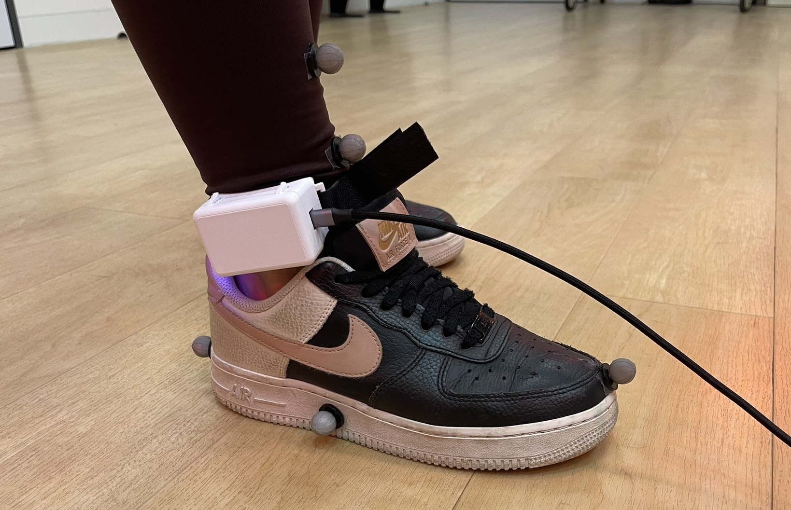
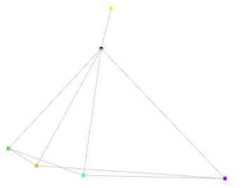

# Dataset  

Official dataset for [https://arxiv.org/abs/2503.17846](https://arxiv.org/abs/2503.17846).  

  
  

*Left to right: 1) The recording process demonstrated on one of the ten subjects. The ankleband is connected to the computer via a serial port for data collection, while motion capture stickers are being used to monitor the gestures and label them after session. 2) An illustration of the reconstructed leg of the subject from the motion capture data during the labeling session.*

## Download Link  

[https://drive.google.com/drive/folders/1y8jEzIqXjVrDSTeh9xj0k87Y6jcpchoy?usp=sharing](https://drive.google.com/drive/folders/1y8jEzIqXjVrDSTeh9xj0k87Y6jcpchoy?usp=sharing)

## Overview  

The dataset was collected from 10 subjects, averaging at 27 years old, five of whom are men and five of whom are women. 
  
During data collection, the frequency of the IMU sensor was set to 200 Hz, and a Vicon motion-capture system was used to monitor the motion of the foot to compute label intervals after the recordings. All subjects wore the smart ankleband on their right leg and were confirmed to be right-footed and without any neurological disorders or conditions in their legs.

Subjects were instructed to repeatedly perform each gesture for one or two minutes, depending on their performance. In addition, subjects were asked to behave naturally for an additional period of two minutes  to collect data that will serve as noise, or no leg gesture, for accurate model training. We repeated this process two times. In the first time, subjects were instructed to sit in a chair and perform the aforementioned process. In the second time, subjects were instructed to repeat the entire process while standing. In total, for each subject we recorded 8-16 labeled leg gestures and four additional minutes of regular activity. The process was approved by the institution's Ethics Committee. The final dataset includes a total of 2.5 million samples.

## Structure

Each H5 file name is composed of the subject's ID (01 to 10) and the setting of the recording (seating or standing). Each H5 file contains a Pandas DataFrame table of the data itself. The columns are the data features while the rows are the data samples ordered by recorded timestamp.  

The data contains the following columns:  

* datetime - The official timestamp of the sample.  
* label - the index of the gesture label at the given timestamp (or 0 if none).  
* acc_x - accelerometer x-value.  
* acc_y - accelerometer y-value.  
* acc_z - accelerometer z-value.  
* gyro_x - gyroscope x-value.  
* gyro_y - gyroscope y-value.  
* gyro_z - gyroscope z-value.  
* sample_index - the index of the sample in the dataframe.  

Notice there might be other data columns in the dataframe that were not used in this paper.  